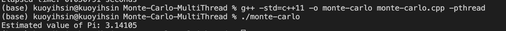

# Monte Carlo method with multithreading

This is a C++ program that estimates the value of Pi using the Monte Carlo method with multithreading.

## 環境建置

To run this program, you will need a C++ compiler installed on your computer. This program uses C++11 features, so make sure your compiler supports it. You can use g++ or clang++ to compile the code.

## 如何執行程式

To compile the program, open a terminal and navigate to the directory where the source file is located. Then, use the following command to compile the code:

```
g++ -std=c++11 -pthread monte-carlo.cpp -o monte-carlo
```

This will create an executable file called `monte-carlo`. To run the program, use the following command:

```
./monte-carlo
```

By default, the program generates 1,000,000 random points and uses 4 threads. You can modify these values in the `main()` function.

## 執行結果


## 程式碼說明

The program uses the Monte Carlo method to estimate the value of Pi. It generates random points inside a square with sides of length 2 and centered at the origin. It then counts the number of points that fall inside the inscribed circle with radius 1 and centered at the origin. The ratio of the number of points inside the circle to the total number of points generated is an estimate of Pi/4.

The `generate_points()` function generates random points and counts the ones that fall inside the circle. It uses a mutex to synchronize access to the global variables `points_in_circle` and `total_points`.

The `monte_carlo_pi_multithreaded()` function creates multiple threads and assigns an equal number of points to each thread. It then waits for all threads to finish and calculates the estimated value of Pi.

The `main()` function calls the `monte_carlo_pi_multithreaded()` functiony. It prints the estimated value of Pi to the console.
